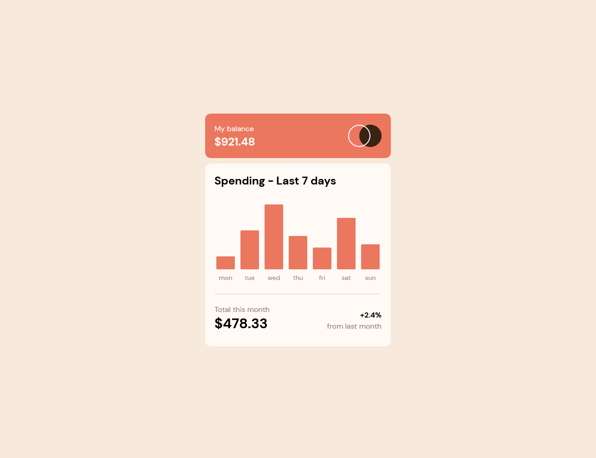

# Frontend Mentor - QR code component solution

This is a solution to the [QR code component challenge on Frontend Mentor](https://www.frontendmentor.io/challenges/qr-code-component-iux_sIO_H). Frontend Mentor challenges help you improve your coding skills by building realistic projects. 

## Table of contents

- [Overview](#overview)
  - [Screenshot](#screenshot)
  - [Links](#links)
- [My process](#my-process)
  - [Built with](#built-with)
  - [What I learned](#what-i-learned)
  - [Continued development](#continued-development)
  - [Useful resources](#useful-resources)
- [Author](#author)

## Overview
This is my first project on Frontend Mentor so I'm going with a newbie project that I like, the qr-code-component. I want to over estimate on my first project because I think that it's better than under estimating. I also want to be close on my estimation because I feel like that is very important in a professional environment. I also want to note that I'm currently not using the Pro version so I don't have access to the Figma files but I do want to incorporate a designing and project plan phase in my estimate.

- Planning: 0.5 hours
- Analysis: 0.5 hours
- Design: 0 (Already completed)
- Development: 2 hour
- Testing: 1 hour
- Maintenance: 0 (Not in the scope)

Total: 4 hours

### Screenshot



### Links

- Solution URL: [Add solution URL here](https://github.com/11kyle/expenses-chart-component-main)
- Live Site URL: [Add live site URL here](https://11kyle.github.io/expenses-chart-component-main/)

## My process

- Planning: My planning for this small project was minimal. I didn't document a project plan.
- Analysis: I selected which languages, frameworks and foundations to use. They are TailwindCSS, Create React App, GitHub Pages. I've been focusing on learning TailwindCSS and that's why is chose it over others like Bootstrap.
- Development: Used VS Code as my IDE. I have experience with MacOS and Windows but chose Windows for this project.
- Testing: Included opening the project in multiple browers and different screen sizes. Also, tested on my iPhone with Safari and Google Chrome by hosting my solution on Github Pages.

### Built with

- Semantic HTML5 markup
- CSS custom properties
- Flexbox
- Mobile-first workflow
- [React](https://reactjs.org/) - JS library
- [Create React App](https://create-react-app.dev/) - React framework
- [Tailwind](https://tailwindcss.com/) - For styles

### What I learned

I learned about onMouseEnter and onMouseLeave as well as the other event handlers. I used these to show a ```<span>``` when hovering over a bar in a bar graph.

This project took longer than I thought it would. I did add the bonus on hover objective but I still went over the estimated time by roughly 10%. On a small estimate like this, 10% wasn't much time but I'm glad to be getting this time estimation experience.

### Continued development

I would like to spend more time using Figma and calculation project plans. I also plan on implementing more event handlers in future projects. Lastly, I would like to add testing to future projects or come back to this project and add tests. For this project, it would be good to have edge case test for the included data.

### Useful resources

- [Stack Overflow](https://stackoverflow.com/) - Possible the best overall place to get help from the community. You can find a solution to every problem you face and if not, post your own.
- [MDN Web Docs](https://developer.mozilla.org/en-US/) - MDN Web Docs are great for reminding you everything you forget. I often use it to look up attributes for html tags and JavaScript methods.
- [TailwindCSS](https://tailwindcss.com/) - This is the documentation for TailwindCSS. It's always open when I use it as my CSS framework.
- [Deploying a React App to GitHub Pages](https://github.com/gitname/react-gh-pages) - This is the documentation on how to deploy a React App to GitHub Pages.

## Author

- Github - [Kyle](https://github.com/11kyle)
- Frontend Mentor - [@11kyle](https://www.frontendmentor.io/profile/11kyle)
- LinkedIn - [Kyle](https://www.linkedin.com/in/kylejohnsondeveloper/)